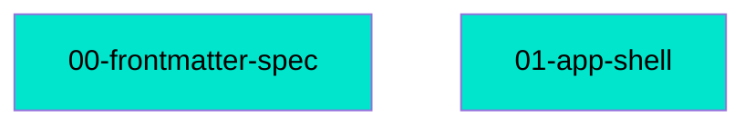
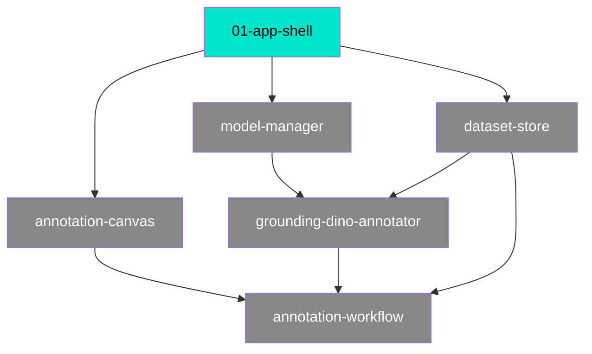

# Connections

Auto-generated by `/mdd`. Do not edit by hand — it is rewritten on every feature completion.

## Path Tree

```
Meta
└── Schema  00-frontmatter-spec  complete
Platform
└── Shell  01-app-shell  complete
```

## Dependency Graph



`01-app-shell` has no dependencies — it is the root of the Wave 1 graph. The remaining
Wave 1 features all depend on it:



## Source File Overlap

No source file is referenced by two or more docs yet.

## Warnings

None. No broken `depends_on` references, no cycles, every doc has a `path`.
