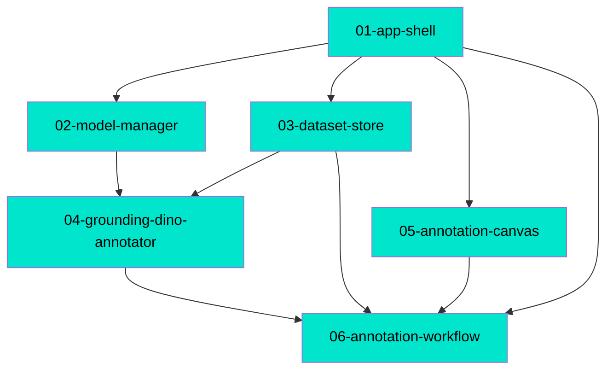

# Connections

Auto-generated by `/mdd`. Do not edit by hand — it is rewritten on every feature completion.

## Path Tree

```
Admin
└── Models  02-model-manager  complete
Meta
└── Schema  00-frontmatter-spec  complete
Platform
├── Datasets  03-dataset-store  complete
└── Shell  01-app-shell  complete
Studio
├── Annotation  04-grounding-dino-annotator  complete
├── Annotation  06-annotation-workflow  complete
└── Canvas  05-annotation-canvas  complete
```

## Dependency Graph



## Source File Overlap

| File | Docs |
|------|------|
| `apps/frontend/src/styles.css` | 01-app-shell, 05-annotation-canvas, 06-annotation-workflow |
| `apps/frontend/src/tabs/AnnotationStudioTab.tsx` | 01-app-shell, 06-annotation-workflow |
| `apps/frontend/src/tabs/AdminTab.tsx` | 01-app-shell, 02-model-manager |

Expected: `01-app-shell` created the tab stubs and the stylesheet; later features replaced
their own tab and appended their own styles.

## Warnings

None. No broken `depends_on` references, no cycles, every doc has a `path`.

All `satisfies_contracts` entries across the wave are `status: done` with a
`verified_at` call site.
