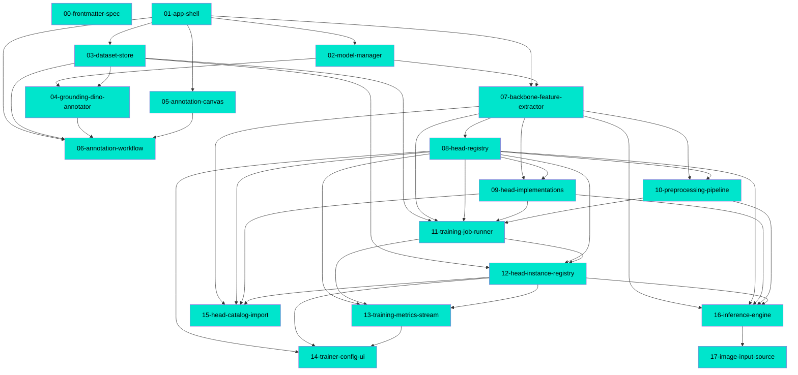

# Connections

## Path Tree

```
Admin/Models
└── Models  02-model-manager  complete
Inference/Engine
└── Engine  16-inference-engine  complete
Inference/Input
└── Input  17-image-input-source  complete
Meta/Schema
└── Schema  00-frontmatter-spec  complete
Platform/Datasets
└── Datasets  03-dataset-store  complete
Platform/Shell
└── Shell  01-app-shell  complete
Studio/Annotation
├── Annotation  04-grounding-dino-annotator  complete
└── Annotation  06-annotation-workflow  complete
Studio/Canvas
└── Canvas  05-annotation-canvas  complete
Training/Backbone
└── Backbone  07-backbone-feature-extractor  complete
Training/Heads
├── Heads  08-head-registry  complete
├── Heads  09-head-implementations  complete
├── Heads  12-head-instance-registry  complete
└── Heads  15-head-catalog-import  complete
Training/Preprocessing
└── Preprocessing  10-preprocessing-pipeline  complete
Training/Runner
├── Runner  11-training-job-runner  complete
└── Runner  13-training-metrics-stream  complete
Training/UI
└── UI  14-trainer-config-ui  complete
```

## Dependency Graph



## Source File Overlap

- `apps/frontend/src/api/client.ts` — 01-app-shell, 13-training-metrics-stream
- `apps/frontend/src/api/headInstances.ts` — 12-head-instance-registry, 15-head-catalog-import
- `apps/frontend/src/api/types.ts` — 01-app-shell, 07-backbone-feature-extractor
- `apps/frontend/src/components/SessionSetup.tsx` — 06-annotation-workflow, 17-image-input-source
- `apps/frontend/src/styles.css` — 01-app-shell, 05-annotation-canvas, 06-annotation-workflow, 14-trainer-config-ui, 15-head-catalog-import, 17-image-input-source
- `apps/frontend/src/tabs/AdminTab.tsx` — 01-app-shell, 02-model-manager, 15-head-catalog-import
- `apps/frontend/src/tabs/AnnotationStudioTab.tsx` — 01-app-shell, 06-annotation-workflow
- `apps/frontend/src/tabs/HeadTrainerTab.tsx` — 01-app-shell, 14-trainer-config-ui
- `apps/frontend/src/tabs/InferenceViewerTab.tsx` — 01-app-shell, 17-image-input-source
- `backend/app/api/v1/inference.py` — 16-inference-engine, 17-image-input-source
- `backend/app/api/v1/router.py` — 01-app-shell, 07-backbone-feature-extractor, 08-head-registry, 12-head-instance-registry, 13-training-metrics-stream, 15-head-catalog-import, 16-inference-engine
- `backend/app/datasets/db.py` — 03-dataset-store, 12-head-instance-registry
- `backend/app/ml/heads/builders.py` — 09-head-implementations, 15-head-catalog-import
- `backend/app/ml/heads/registry.py` — 08-head-registry, 15-head-catalog-import
- `backend/app/ml/preprocess.py` — 10-preprocessing-pipeline, 16-inference-engine
- `backend/app/ml/training/job.py` — 11-training-job-runner, 13-training-metrics-stream
- `backend/app/ml/training/runner.py` — 11-training-job-runner, 13-training-metrics-stream, 16-inference-engine

## Warnings

(none)
