# Connections

Generated from feature-doc frontmatter only. Do not edit by hand — regenerate after a wave.

## Path Tree

```
API/Guide
└── 63-agent-api-guide  complete

Admin / Models/Distribution
└── 54-distribution-licensing  complete

Admin / Models/GPU
└── 57-gpu-support-download  complete

Admin/Models
├── 02-model-manager  complete
├── 35-model-licence-surfacing  complete
└── 65-starter-set  complete

Annotation Studio/Head Mode
├── 32-shared-head-picker  complete
└── 33-studio-head-annotator  complete

Annotation Studio/Input
├── 40-drag-and-drop-input  complete
├── 50-dataset-as-source  complete
└── 59-reveal-dataset-folder  complete

Annotation Studio/Prescan
└── 53-prescan  complete

Annotation Studio/Prompting
└── 39-prompt-guidance  complete

Annotation Studio/Proposals
└── 42-foundation-boxes-everywhere  complete

Annotation Studio/Review
├── 47-box-review-list  complete
├── 60-box-class-picker  complete
├── 61-studio-mask-review  complete
└── 67-annotation-view-and-output  complete

Connection/MCP
└── 64-mcp-server  complete

Dataset Generator/Input
└── 46-generator-folder-picker  complete

Dataset Generator/Proposals
├── 25-expert-annotator  complete
├── 27-grounded-sam-annotator  complete
└── 30-sam3-annotator  complete

Dataset Generator/Review
├── 26-generator-review-ui  complete
└── 28-mask-review-ui  complete

Dataset Generator/Save
└── 29-generated-dataset-writer  complete

Dataset Store/Import
└── 31-external-dataset-import  complete

Datasets/Import
└── 49-osdar23-rail  complete

Head Trainer/Detection
└── 43-detection-localisation  complete

Head Trainer/Fine-tuning
├── 44-finetune-rf-detr  complete
└── 55-unfreezing  complete

Head Trainer/Help
└── 48-dataset-format-guide  complete

Inference Viewer/Foundation Models
└── 66-prompted-detection-everywhere  complete

Inference Viewer/Foundation models
└── 45-concept-segmentation-everywhere  complete

Inference Viewer/Picker
└── 52-dataset-filter  complete

Inference Viewer/Playback
└── 68-video-playback  complete

Inference Viewer/Tiling
└── 62-tiled-inference  complete

Inference/Compare
├── 21-same-task-head-compare  complete
├── 34-inference-picker-upfront  complete
├── 36-depth-foundation-model  complete
├── 37-foundation-model-in-viewer  complete
└── 41-rf-detr-detector  complete

Inference/Compose
└── 18-multi-head-compose  complete

Inference/Engine
└── 16-inference-engine  complete

Inference/Input
└── 17-image-input-source  complete

Inference/Overlay
└── 20-inference-overlay-render  complete

Inference/Viewer
└── 19-side-by-side-viewer  complete

Library
└── 51-library-tab  complete

Meta/Schema
└── 00-frontmatter-spec  complete

Packaging/Installers
└── 58-installers  complete

Packaging/Sidecar
└── 56-sidecar-bundling  complete

Platform/Annotators
└── 23-mask-annotator-registry  complete

Platform/Datasets
├── 03-dataset-store  complete
└── 22-mask-dataset-store  complete

Platform/Settings
└── 24-hf-token-settings  complete

Platform/Shell
└── 01-app-shell  complete

Start Here
└── 38-intro-tab  complete

Studio/Annotation
├── 04-grounding-dino-annotator  complete
└── 06-annotation-workflow  complete

Studio/Canvas
└── 05-annotation-canvas  complete

Training/Backbone
└── 07-backbone-feature-extractor  complete

Training/Heads
├── 08-head-registry  complete
├── 09-head-implementations  complete
├── 12-head-instance-registry  complete
└── 15-head-catalog-import  complete

Training/Preprocessing
└── 10-preprocessing-pipeline  complete

Training/Runner
├── 11-training-job-runner  complete
└── 13-training-metrics-stream  complete

Training/UI
└── 14-trainer-config-ui  complete

```

## Dependency Graph

```mermaid
graph LR
  00_frontmatter_spec["00-frontmatter-spec"]:::complete
  01_app_shell["01-app-shell"]:::complete
  02_model_manager["02-model-manager"]:::complete
  03_dataset_store["03-dataset-store"]:::complete
  04_grounding_dino_annotator["04-grounding-dino-annotator"]:::complete
  05_annotation_canvas["05-annotation-canvas"]:::complete
  06_annotation_workflow["06-annotation-workflow"]:::complete
  07_backbone_feature_extractor["07-backbone-feature-extractor"]:::complete
  08_head_registry["08-head-registry"]:::complete
  09_head_implementations["09-head-implementations"]:::complete
  10_preprocessing_pipeline["10-preprocessing-pipeline"]:::complete
  11_training_job_runner["11-training-job-runner"]:::complete
  12_head_instance_registry["12-head-instance-registry"]:::complete
  13_training_metrics_stream["13-training-metrics-stream"]:::complete
  14_trainer_config_ui["14-trainer-config-ui"]:::complete
  15_head_catalog_import["15-head-catalog-import"]:::complete
  16_inference_engine["16-inference-engine"]:::complete
  17_image_input_source["17-image-input-source"]:::complete
  18_multi_head_compose["18-multi-head-compose"]:::complete
  19_side_by_side_viewer["19-side-by-side-viewer"]:::complete
  20_inference_overlay_render["20-inference-overlay-render"]:::complete
  21_same_task_head_compare["21-same-task-head-compare"]:::complete
  22_mask_dataset_store["22-mask-dataset-store"]:::complete
  23_mask_annotator_registry["23-mask-annotator-registry"]:::complete
  24_hf_token_settings["24-hf-token-settings"]:::complete
  25_expert_annotator["25-expert-annotator"]:::complete
  26_generator_review_ui["26-generator-review-ui"]:::complete
  27_grounded_sam_annotator["27-grounded-sam-annotator"]:::complete
  28_mask_review_ui["28-mask-review-ui"]:::complete
  29_generated_dataset_writer["29-generated-dataset-writer"]:::complete
  30_sam3_annotator["30-sam3-annotator"]:::complete
  31_external_dataset_import["31-external-dataset-import"]:::complete
  32_shared_head_picker["32-shared-head-picker"]:::complete
  33_studio_head_annotator["33-studio-head-annotator"]:::complete
  34_inference_picker_upfront["34-inference-picker-upfront"]:::complete
  35_model_licence_surfacing["35-model-licence-surfacing"]:::complete
  36_depth_foundation_model["36-depth-foundation-model"]:::complete
  37_foundation_model_in_viewer["37-foundation-model-in-viewer"]:::complete
  38_intro_tab["38-intro-tab"]:::complete
  39_prompt_guidance["39-prompt-guidance"]:::complete
  40_drag_and_drop_input["40-drag-and-drop-input"]:::complete
  41_rf_detr_detector["41-rf-detr-detector"]:::complete
  42_foundation_boxes_everywhere["42-foundation-boxes-everywhere"]:::complete
  43_detection_localisation["43-detection-localisation"]:::complete
  44_finetune_rf_detr["44-finetune-rf-detr"]:::complete
  45_concept_segmentation_everywhere["45-concept-segmentation-everywhere"]:::complete
  46_generator_folder_picker["46-generator-folder-picker"]:::complete
  47_box_review_list["47-box-review-list"]:::complete
  48_dataset_format_guide["48-dataset-format-guide"]:::complete
  49_osdar23_rail["49-osdar23-rail"]:::complete
  50_dataset_as_source["50-dataset-as-source"]:::complete
  51_library_tab["51-library-tab"]:::complete
  52_dataset_filter["52-dataset-filter"]:::complete
  53_prescan["53-prescan"]:::complete
  54_distribution_licensing["54-distribution-licensing"]:::complete
  55_unfreezing["55-unfreezing"]:::complete
  56_sidecar_bundling["56-sidecar-bundling"]:::complete
  57_gpu_support_download["57-gpu-support-download"]:::complete
  58_installers["58-installers"]:::complete
  59_reveal_dataset_folder["59-reveal-dataset-folder"]:::complete
  60_box_class_picker["60-box-class-picker"]:::complete
  61_studio_mask_review["61-studio-mask-review"]:::complete
  62_tiled_inference["62-tiled-inference"]:::complete
  63_agent_api_guide["63-agent-api-guide"]:::complete
  64_mcp_server["64-mcp-server"]:::complete
  65_starter_set["65-starter-set"]:::complete
  66_prompted_detection_everywhere["66-prompted-detection-everywhere"]:::complete
  67_annotation_view_and_output["67-annotation-view-and-output"]:::complete
  68_video_playback["68-video-playback"]:::complete
  01_app_shell --> 02_model_manager
  01_app_shell --> 03_dataset_store
  02_model_manager --> 04_grounding_dino_annotator
  03_dataset_store --> 04_grounding_dino_annotator
  01_app_shell --> 05_annotation_canvas
  01_app_shell --> 06_annotation_workflow
  03_dataset_store --> 06_annotation_workflow
  04_grounding_dino_annotator --> 06_annotation_workflow
  05_annotation_canvas --> 06_annotation_workflow
  01_app_shell --> 07_backbone_feature_extractor
  02_model_manager --> 07_backbone_feature_extractor
  07_backbone_feature_extractor --> 08_head_registry
  07_backbone_feature_extractor --> 09_head_implementations
  08_head_registry --> 09_head_implementations
  07_backbone_feature_extractor --> 10_preprocessing_pipeline
  08_head_registry --> 10_preprocessing_pipeline
  03_dataset_store --> 11_training_job_runner
  07_backbone_feature_extractor --> 11_training_job_runner
  08_head_registry --> 11_training_job_runner
  09_head_implementations --> 11_training_job_runner
  10_preprocessing_pipeline --> 11_training_job_runner
  03_dataset_store --> 12_head_instance_registry
  08_head_registry --> 12_head_instance_registry
  11_training_job_runner --> 12_head_instance_registry
  08_head_registry --> 13_training_metrics_stream
  11_training_job_runner --> 13_training_metrics_stream
  12_head_instance_registry --> 13_training_metrics_stream
  08_head_registry --> 14_trainer_config_ui
  12_head_instance_registry --> 14_trainer_config_ui
  13_training_metrics_stream --> 14_trainer_config_ui
  07_backbone_feature_extractor --> 15_head_catalog_import
  08_head_registry --> 15_head_catalog_import
  09_head_implementations --> 15_head_catalog_import
  12_head_instance_registry --> 15_head_catalog_import
  07_backbone_feature_extractor --> 16_inference_engine
  08_head_registry --> 16_inference_engine
  09_head_implementations --> 16_inference_engine
  10_preprocessing_pipeline --> 16_inference_engine
  12_head_instance_registry --> 16_inference_engine
  16_inference_engine --> 17_image_input_source
  16_inference_engine --> 18_multi_head_compose
  17_image_input_source --> 19_side_by_side_viewer
  18_multi_head_compose --> 20_inference_overlay_render
  19_side_by_side_viewer --> 20_inference_overlay_render
  18_multi_head_compose --> 21_same_task_head_compare
  20_inference_overlay_render --> 21_same_task_head_compare
  03_dataset_store --> 22_mask_dataset_store
  22_mask_dataset_store --> 23_mask_annotator_registry
  02_model_manager --> 23_mask_annotator_registry
  02_model_manager --> 24_hf_token_settings
  23_mask_annotator_registry --> 24_hf_token_settings
  16_inference_engine --> 25_expert_annotator
  18_multi_head_compose --> 25_expert_annotator
  03_dataset_store --> 25_expert_annotator
  25_expert_annotator --> 26_generator_review_ui
  05_annotation_canvas --> 26_generator_review_ui
  12_head_instance_registry --> 26_generator_review_ui
  23_mask_annotator_registry --> 27_grounded_sam_annotator
  22_mask_dataset_store --> 27_grounded_sam_annotator
  04_grounding_dino_annotator --> 27_grounded_sam_annotator
  27_grounded_sam_annotator --> 28_mask_review_ui
  26_generator_review_ui --> 28_mask_review_ui
  20_inference_overlay_render --> 28_mask_review_ui
  22_mask_dataset_store --> 29_generated_dataset_writer
  26_generator_review_ui --> 29_generated_dataset_writer
  28_mask_review_ui --> 29_generated_dataset_writer
  23_mask_annotator_registry --> 30_sam3_annotator
  27_grounded_sam_annotator --> 30_sam3_annotator
  24_hf_token_settings --> 30_sam3_annotator
  03_dataset_store --> 31_external_dataset_import
  22_mask_dataset_store --> 31_external_dataset_import
  12_head_instance_registry --> 32_shared_head_picker
  26_generator_review_ui --> 32_shared_head_picker
  06_annotation_workflow --> 33_studio_head_annotator
  25_expert_annotator --> 33_studio_head_annotator
  32_shared_head_picker --> 33_studio_head_annotator
  19_side_by_side_viewer --> 34_inference_picker_upfront
  32_shared_head_picker --> 34_inference_picker_upfront
  02_model_manager --> 35_model_licence_surfacing
  02_model_manager --> 36_depth_foundation_model
  16_inference_engine --> 36_depth_foundation_model
  35_model_licence_surfacing --> 36_depth_foundation_model
  19_side_by_side_viewer --> 37_foundation_model_in_viewer
  34_inference_picker_upfront --> 37_foundation_model_in_viewer
  36_depth_foundation_model --> 37_foundation_model_in_viewer
  01_app_shell --> 38_intro_tab
  06_annotation_workflow --> 39_prompt_guidance
  33_studio_head_annotator --> 39_prompt_guidance
  17_image_input_source --> 40_drag_and_drop_input
  06_annotation_workflow --> 40_drag_and_drop_input
  02_model_manager --> 41_rf_detr_detector
  35_model_licence_surfacing --> 41_rf_detr_detector
  36_depth_foundation_model --> 41_rf_detr_detector
  41_rf_detr_detector --> 42_foundation_boxes_everywhere
  25_expert_annotator --> 42_foundation_boxes_everywhere
  33_studio_head_annotator --> 42_foundation_boxes_everywhere
  09_head_implementations --> 43_detection_localisation
  11_training_job_runner --> 43_detection_localisation
  41_rf_detr_detector --> 44_finetune_rf_detr
  11_training_job_runner --> 44_finetune_rf_detr
  12_head_instance_registry --> 44_finetune_rf_detr
  23_mask_annotator_registry --> 45_concept_segmentation_everywhere
  36_depth_foundation_model --> 45_concept_segmentation_everywhere
  42_foundation_boxes_everywhere --> 45_concept_segmentation_everywhere
  40_drag_and_drop_input --> 46_generator_folder_picker
  05_annotation_canvas --> 47_box_review_list
  42_foundation_boxes_everywhere --> 47_box_review_list
  31_external_dataset_import --> 48_dataset_format_guide
  31_external_dataset_import --> 49_osdar23_rail
  43_detection_localisation --> 49_osdar23_rail
  44_finetune_rf_detr --> 49_osdar23_rail
  46_generator_folder_picker --> 50_dataset_as_source
  17_image_input_source --> 50_dataset_as_source
  12_head_instance_registry --> 51_library_tab
  44_finetune_rf_detr --> 51_library_tab
  34_inference_picker_upfront --> 52_dataset_filter
  12_head_instance_registry --> 52_dataset_filter
  06_annotation_workflow --> 53_prescan
  42_foundation_boxes_everywhere --> 53_prescan
  11_training_job_runner --> 53_prescan
  35_model_licence_surfacing --> 54_distribution_licensing
  51_library_tab --> 54_distribution_licensing
  44_finetune_rf_detr --> 55_unfreezing
  43_detection_localisation --> 55_unfreezing
  49_osdar23_rail --> 55_unfreezing
  56_sidecar_bundling --> 57_gpu_support_download
  56_sidecar_bundling --> 58_installers
  57_gpu_support_download --> 58_installers
  50_dataset_as_source --> 59_reveal_dataset_folder
  46_generator_folder_picker --> 59_reveal_dataset_folder
  47_box_review_list --> 60_box_class_picker
  03_dataset_store --> 60_box_class_picker
  50_dataset_as_source --> 60_box_class_picker
  45_concept_segmentation_everywhere --> 61_studio_mask_review
  47_box_review_list --> 61_studio_mask_review
  22_mask_dataset_store --> 61_studio_mask_review
  28_mask_review_ui --> 61_studio_mask_review
  49_osdar23_rail --> 62_tiled_inference
  16_inference_engine --> 62_tiled_inference
  18_multi_head_compose --> 62_tiled_inference
  43_detection_localisation --> 62_tiled_inference
  01_app_shell --> 63_agent_api_guide
  38_intro_tab --> 63_agent_api_guide
  63_agent_api_guide --> 64_mcp_server
  01_app_shell --> 64_mcp_server
  02_model_manager --> 65_starter_set
  23_mask_annotator_registry --> 65_starter_set
  35_model_licence_surfacing --> 65_starter_set
  04_grounding_dino_annotator --> 66_prompted_detection_everywhere
  42_foundation_boxes_everywhere --> 66_prompted_detection_everywhere
  45_concept_segmentation_everywhere --> 66_prompted_detection_everywhere
  22_mask_dataset_store --> 67_annotation_view_and_output
  28_mask_review_ui --> 67_annotation_view_and_output
  45_concept_segmentation_everywhere --> 67_annotation_view_and_output
  61_studio_mask_review --> 67_annotation_view_and_output
  16_inference_engine --> 68_video_playback
  17_image_input_source --> 68_video_playback
  18_multi_head_compose --> 68_video_playback
  53_prescan --> 68_video_playback
  classDef complete fill:#00e5cc,color:#000
  classDef in_progress fill:#ffaa00,color:#000
  classDef draft fill:#888,color:#fff
  classDef deprecated fill:#555,color:#aaa
```



## Source File Overlap

Files touched by more than one doc — the places where a change needs two docs read.

- `apps/desktop/src-tauri/BUNDLING.md` — 57-gpu-support-download, 58-installers
- `apps/desktop/src-tauri/Cargo.toml` — 01-app-shell, 59-reveal-dataset-folder
- `apps/desktop/src-tauri/capabilities/default.json` — 01-app-shell, 59-reveal-dataset-folder
- `apps/desktop/src-tauri/src/lib.rs` — 01-app-shell, 56-sidecar-bundling, 58-installers, 59-reveal-dataset-folder
- `apps/desktop/src-tauri/src/sidecar.rs` — 01-app-shell, 56-sidecar-bundling, 57-gpu-support-download, 58-installers
- `apps/desktop/src-tauri/tauri.conf.json` — 01-app-shell, 56-sidecar-bundling, 68-video-playback
- `apps/desktop/src-tauri/tauri.release.conf.json` — 57-gpu-support-download, 58-installers
- `apps/frontend/src/App.tsx` — 01-app-shell, 38-intro-tab, 51-library-tab, 63-agent-api-guide
- `apps/frontend/src/api/annotators.ts` — 27-grounded-sam-annotator, 28-mask-review-ui
- `apps/frontend/src/api/client.ts` — 01-app-shell, 13-training-metrics-stream
- `apps/frontend/src/api/datasets.ts` — 06-annotation-workflow, 29-generated-dataset-writer, 31-external-dataset-import, 50-dataset-as-source, 51-library-tab, 59-reveal-dataset-folder, 61-studio-mask-review
- `apps/frontend/src/api/foundation.ts` — 37-foundation-model-in-viewer, 42-foundation-boxes-everywhere, 44-finetune-rf-detr, 45-concept-segmentation-everywhere, 51-library-tab, 55-unfreezing, 61-studio-mask-review
- `apps/frontend/src/api/generate.ts` — 26-generator-review-ui, 28-mask-review-ui
- `apps/frontend/src/api/headInstances.ts` — 12-head-instance-registry, 15-head-catalog-import, 26-generator-review-ui, 32-shared-head-picker, 62-tiled-inference
- `apps/frontend/src/api/inference.ts` — 17-image-input-source, 20-inference-overlay-render, 37-foundation-model-in-viewer, 62-tiled-inference
- `apps/frontend/src/api/models.ts` — 02-model-manager, 24-hf-token-settings, 35-model-licence-surfacing, 54-distribution-licensing, 57-gpu-support-download, 65-starter-set
- `apps/frontend/src/api/types.ts` — 01-app-shell, 07-backbone-feature-extractor
- `apps/frontend/src/components/AnnotationCanvas.tsx` — 05-annotation-canvas, 47-box-review-list, 61-studio-mask-review, 67-annotation-view-and-output
- `apps/frontend/src/components/BoxReviewList.tsx` — 47-box-review-list, 60-box-class-picker
- `apps/frontend/src/components/CounterBar.tsx` — 06-annotation-workflow, 29-generated-dataset-writer
- `apps/frontend/src/components/ExpertHeadPicker.tsx` — 26-generator-review-ui, 32-shared-head-picker
- `apps/frontend/src/components/FinetunePanel.tsx` — 44-finetune-rf-detr, 55-unfreezing
- `apps/frontend/src/components/FoundationPicker.tsx` — 42-foundation-boxes-everywhere, 45-concept-segmentation-everywhere, 66-prompted-detection-everywhere
- `apps/frontend/src/components/GeneratorSetup.tsx` — 26-generator-review-ui, 27-grounded-sam-annotator, 28-mask-review-ui, 29-generated-dataset-writer, 30-sam3-annotator, 39-prompt-guidance, 40-drag-and-drop-input, 42-foundation-boxes-everywhere, 46-generator-folder-picker, 50-dataset-as-source, 66-prompted-detection-everywhere, 67-annotation-view-and-output
- `apps/frontend/src/components/HeadRunPanel.tsx` — 20-inference-overlay-render, 21-same-task-head-compare, 32-shared-head-picker, 34-inference-picker-upfront, 37-foundation-model-in-viewer, 45-concept-segmentation-everywhere, 52-dataset-filter, 62-tiled-inference
- `apps/frontend/src/components/ImageSourceField.tsx` — 50-dataset-as-source, 59-reveal-dataset-folder
- `apps/frontend/src/components/ImageSourcePicker.tsx` — 17-image-input-source, 40-drag-and-drop-input, 50-dataset-as-source, 59-reveal-dataset-folder
- `apps/frontend/src/components/MaskReviewCanvas.tsx` — 28-mask-review-ui, 67-annotation-view-and-output
- `apps/frontend/src/components/MaskSourceFields.tsx` — 27-grounded-sam-annotator, 42-foundation-boxes-everywhere
- `apps/frontend/src/components/ModelCard.tsx` — 02-model-manager, 35-model-licence-surfacing
- `apps/frontend/src/components/SessionSetup.tsx` — 06-annotation-workflow, 17-image-input-source, 33-studio-head-annotator, 39-prompt-guidance, 40-drag-and-drop-input, 42-foundation-boxes-everywhere, 45-concept-segmentation-everywhere, 46-generator-folder-picker, 50-dataset-as-source
- `apps/frontend/src/components/SideBySideViewer.tsx` — 19-side-by-side-viewer, 21-same-task-head-compare
- `apps/frontend/src/components/overlays/MapOverlay.tsx` — 20-inference-overlay-render, 28-mask-review-ui, 61-studio-mask-review
- `apps/frontend/src/components/overlays/registry.tsx` — 20-inference-overlay-render, 67-annotation-view-and-output
- `apps/frontend/src/hooks/useAnnotationSession.ts` — 06-annotation-workflow, 33-studio-head-annotator, 42-foundation-boxes-everywhere, 45-concept-segmentation-everywhere, 50-dataset-as-source, 53-prescan, 61-studio-mask-review
- `apps/frontend/src/hooks/useGeneratorSession.ts` — 26-generator-review-ui, 28-mask-review-ui, 29-generated-dataset-writer, 42-foundation-boxes-everywhere, 50-dataset-as-source, 53-prescan, 66-prompted-detection-everywhere
- `apps/frontend/src/hooks/useHeadRun.ts` — 20-inference-overlay-render, 21-same-task-head-compare, 37-foundation-model-in-viewer, 45-concept-segmentation-everywhere, 52-dataset-filter, 62-tiled-inference
- `apps/frontend/src/hooks/useImageSource.ts` — 17-image-input-source, 50-dataset-as-source
- `apps/frontend/src/hooks/useLibrary.ts` — 51-library-tab, 54-distribution-licensing
- `apps/frontend/src/hooks/useSessionImages.ts` — 50-dataset-as-source, 61-studio-mask-review
- `apps/frontend/src/lib/dialog.ts` — 17-image-input-source, 59-reveal-dataset-folder
- `apps/frontend/src/lib/generatorProposal.ts` — 53-prescan, 66-prompted-detection-everywhere
- `apps/frontend/src/styles.css` — 01-app-shell, 05-annotation-canvas, 06-annotation-workflow, 14-trainer-config-ui, 15-head-catalog-import, 17-image-input-source, 19-side-by-side-viewer, 20-inference-overlay-render, 21-same-task-head-compare, 26-generator-review-ui, 28-mask-review-ui, 32-shared-head-picker, 34-inference-picker-upfront, 35-model-licence-surfacing, 38-intro-tab, 39-prompt-guidance, 40-drag-and-drop-input, 44-finetune-rf-detr, 45-concept-segmentation-everywhere, 47-box-review-list, 48-dataset-format-guide, 54-distribution-licensing, 57-gpu-support-download, 59-reveal-dataset-folder, 60-box-class-picker, 61-studio-mask-review, 62-tiled-inference, 63-agent-api-guide, 64-mcp-server, 65-starter-set
- `apps/frontend/src/tabs/AdminTab.tsx` — 01-app-shell, 02-model-manager, 15-head-catalog-import, 24-hf-token-settings, 54-distribution-licensing, 57-gpu-support-download, 65-starter-set
- `apps/frontend/src/tabs/AnnotationStudioTab.tsx` — 01-app-shell, 06-annotation-workflow, 33-studio-head-annotator, 47-box-review-list, 53-prescan, 60-box-class-picker, 61-studio-mask-review, 67-annotation-view-and-output
- `apps/frontend/src/tabs/ApiTab.tsx` — 63-agent-api-guide, 64-mcp-server
- `apps/frontend/src/tabs/DatasetGeneratorTab.tsx` — 01-app-shell, 26-generator-review-ui, 28-mask-review-ui, 29-generated-dataset-writer, 47-box-review-list, 53-prescan
- `apps/frontend/src/tabs/HeadTrainerTab.tsx` — 01-app-shell, 14-trainer-config-ui, 44-finetune-rf-detr, 48-dataset-format-guide
- `apps/frontend/src/tabs/InferenceViewerTab.tsx` — 01-app-shell, 17-image-input-source, 19-side-by-side-viewer, 20-inference-overlay-render, 21-same-task-head-compare, 34-inference-picker-upfront, 67-annotation-view-and-output, 68-video-playback
- `apps/frontend/src/tabs/LibraryTab.tsx` — 51-library-tab, 54-distribution-licensing
- `apps/frontend/src/tabs/introContent.ts` — 38-intro-tab, 51-library-tab
- `apps/frontend/src/tabs/tabs.ts` — 01-app-shell, 38-intro-tab, 51-library-tab, 63-agent-api-guide, 64-mcp-server
- `apps/frontend/src/types/annotation.ts` — 05-annotation-canvas, 26-generator-review-ui, 28-mask-review-ui, 31-external-dataset-import, 42-foundation-boxes-everywhere, 61-studio-mask-review
- `backend/app/api/v1/agent_docs.py` — 63-agent-api-guide, 64-mcp-server
- `backend/app/api/v1/annotators.py` — 23-mask-annotator-registry, 27-grounded-sam-annotator
- `backend/app/api/v1/datasets.py` — 03-dataset-store, 22-mask-dataset-store, 31-external-dataset-import, 50-dataset-as-source, 59-reveal-dataset-folder, 61-studio-mask-review
- `backend/app/api/v1/foundation.py` — 36-depth-foundation-model, 41-rf-detr-detector, 44-finetune-rf-detr, 45-concept-segmentation-everywhere, 51-library-tab, 66-prompted-detection-everywhere
- `backend/app/api/v1/foundation_finetune.py` — 45-concept-segmentation-everywhere, 55-unfreezing
- `backend/app/api/v1/generate.py` — 25-expert-annotator, 27-grounded-sam-annotator, 29-generated-dataset-writer, 62-tiled-inference
- `backend/app/api/v1/generate_foundation.py` — 42-foundation-boxes-everywhere, 45-concept-segmentation-everywhere, 61-studio-mask-review
- `backend/app/api/v1/heads.py` — 12-head-instance-registry, 26-generator-review-ui, 62-tiled-inference
- `backend/app/api/v1/inference.py` — 16-inference-engine, 17-image-input-source, 18-multi-head-compose, 62-tiled-inference
- `backend/app/api/v1/models.py` — 02-model-manager, 35-model-licence-surfacing, 54-distribution-licensing, 65-starter-set
- `backend/app/api/v1/router.py` — 01-app-shell, 07-backbone-feature-extractor, 08-head-registry, 12-head-instance-registry, 13-training-metrics-stream, 15-head-catalog-import, 16-inference-engine, 23-mask-annotator-registry, 24-hf-token-settings, 25-expert-annotator, 36-depth-foundation-model, 45-concept-segmentation-everywhere, 53-prescan, 60-box-class-picker, 63-agent-api-guide
- `backend/app/api/v1/system.py` — 02-model-manager, 57-gpu-support-download
- `backend/app/core/config.py` — 01-app-shell, 24-hf-token-settings
- `backend/app/datasets/coco.py` — 03-dataset-store, 22-mask-dataset-store
- `backend/app/datasets/db.py` — 03-dataset-store, 12-head-instance-registry, 22-mask-dataset-store
- `backend/app/datasets/masks.py` — 22-mask-dataset-store, 29-generated-dataset-writer, 61-studio-mask-review
- `backend/app/datasets/migrations.py` — 22-mask-dataset-store, 23-mask-annotator-registry, 29-generated-dataset-writer, 31-external-dataset-import, 42-foundation-boxes-everywhere
- `backend/app/datasets/models.py` — 03-dataset-store, 22-mask-dataset-store, 23-mask-annotator-registry, 29-generated-dataset-writer, 31-external-dataset-import, 42-foundation-boxes-everywhere
- `backend/app/datasets/schema.py` — 22-mask-dataset-store, 23-mask-annotator-registry, 29-generated-dataset-writer, 31-external-dataset-import, 42-foundation-boxes-everywhere, 60-box-class-picker
- `backend/app/datasets/store.py` — 03-dataset-store, 29-generated-dataset-writer
- `backend/app/main.py` — 01-app-shell, 64-mcp-server
- `backend/app/ml/annotators/build.py` — 27-grounded-sam-annotator, 30-sam3-annotator
- `backend/app/ml/annotators/expert.py` — 25-expert-annotator, 29-generated-dataset-writer, 42-foundation-boxes-everywhere
- `backend/app/ml/annotators/foundation.py` — 42-foundation-boxes-everywhere, 45-concept-segmentation-everywhere, 61-studio-mask-review
- `backend/app/ml/annotators/registry.py` — 23-mask-annotator-registry, 27-grounded-sam-annotator
- `backend/app/ml/backbone.py` — 07-backbone-feature-extractor, 55-unfreezing
- `backend/app/ml/downloads.py` — 02-model-manager, 30-sam3-annotator
- `backend/app/ml/foundation/build.py` — 36-depth-foundation-model, 41-rf-detr-detector, 44-finetune-rf-detr, 45-concept-segmentation-everywhere, 51-library-tab, 66-prompted-detection-everywhere
- `backend/app/ml/foundation/concept.py` — 45-concept-segmentation-everywhere, 61-studio-mask-review, 67-annotation-view-and-output
- `backend/app/ml/foundation/detect.py` — 41-rf-detr-detector, 44-finetune-rf-detr
- `backend/app/ml/foundation/finetune.py` — 44-finetune-rf-detr, 55-unfreezing
- `backend/app/ml/foundation/finetune_runner.py` — 44-finetune-rf-detr, 55-unfreezing
- `backend/app/ml/foundation/registry.py` — 27-grounded-sam-annotator, 36-depth-foundation-model, 41-rf-detr-detector, 44-finetune-rf-detr, 45-concept-segmentation-everywhere, 66-prompted-detection-everywhere
- `backend/app/ml/heads/builders.py` — 09-head-implementations, 15-head-catalog-import
- `backend/app/ml/heads/decode.py` — 16-inference-engine, 31-external-dataset-import, 43-detection-localisation
- `backend/app/ml/heads/modules.py` — 09-head-implementations, 43-detection-localisation
- `backend/app/ml/heads/registry.py` — 08-head-registry, 15-head-catalog-import
- `backend/app/ml/heads/store.py` — 12-head-instance-registry, 62-tiled-inference
- `backend/app/ml/inference/compose.py` — 18-multi-head-compose, 62-tiled-inference
- `backend/app/ml/inference/engine.py` — 16-inference-engine, 18-multi-head-compose, 20-inference-overlay-render
- `backend/app/ml/inference/payloads.py` — 20-inference-overlay-render, 36-depth-foundation-model, 41-rf-detr-detector, 61-studio-mask-review
- `backend/app/ml/inference/results.py` — 16-inference-engine, 25-expert-annotator
- `backend/app/ml/preprocess.py` — 10-preprocessing-pipeline, 16-inference-engine
- `backend/app/ml/registry.py` — 02-model-manager, 23-mask-annotator-registry, 27-grounded-sam-annotator, 35-model-licence-surfacing, 36-depth-foundation-model, 41-rf-detr-detector, 54-distribution-licensing, 65-starter-set
- `backend/app/ml/segmenter.py` — 27-grounded-sam-annotator, 30-sam3-annotator
- `backend/app/ml/training/config.py` — 11-training-job-runner, 55-unfreezing
- `backend/app/ml/training/job.py` — 11-training-job-runner, 13-training-metrics-stream, 55-unfreezing
- `backend/app/ml/training/losses.py` — 11-training-job-runner, 43-detection-localisation
- `backend/app/ml/training/runner.py` — 11-training-job-runner, 13-training-metrics-stream, 16-inference-engine, 55-unfreezing
- `backend/pyproject.toml` — 44-finetune-rf-detr, 58-installers, 64-mcp-server

## Warnings

(none)
