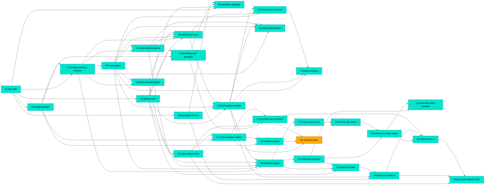

# Connections

Generated from feature-doc frontmatter only. Do not edit by hand — regenerate after a wave.

## Path Tree

```
Admin/Models
└── 02-model-manager  complete

Dataset Generator/Proposals
├── 25-expert-annotator  complete
├── 27-grounded-sam-annotator  complete
└── 30-sam3-annotator  in_progress

Dataset Generator/Review
├── 26-generator-review-ui  complete
└── 28-mask-review-ui  complete

Dataset Generator/Save
└── 29-generated-dataset-writer  complete

Inference/Compare
└── 21-same-task-head-compare  complete

Inference/Compose
└── 18-multi-head-compose  complete

Inference/Engine
└── 16-inference-engine  complete

Inference/Input
└── 17-image-input-source  complete

Inference/Overlay
└── 20-inference-overlay-render  complete

Inference/Viewer
└── 19-side-by-side-viewer  complete

Platform/Annotators
└── 23-mask-annotator-registry  complete

Platform/Datasets
├── 03-dataset-store  complete
└── 22-mask-dataset-store  complete

Platform/Settings
└── 24-hf-token-settings  complete

Platform/Shell
└── 01-app-shell  complete

Studio/Annotation
├── 04-grounding-dino-annotator  complete
└── 06-annotation-workflow  complete

Studio/Canvas
└── 05-annotation-canvas  complete

Training/Backbone
└── 07-backbone-feature-extractor  complete

Training/Heads
├── 08-head-registry  complete
├── 09-head-implementations  complete
├── 12-head-instance-registry  complete
└── 15-head-catalog-import  complete

Training/Preprocessing
└── 10-preprocessing-pipeline  complete

Training/Runner
├── 11-training-job-runner  complete
└── 13-training-metrics-stream  complete

Training/UI
└── 14-trainer-config-ui  complete
```

## Dependency Graph



## Source File Overlap

Files described by more than one doc. Overlap is not itself a problem — it usually means a
later feature extended an earlier one — but a file with many owners is where changes go
unnoticed.

- `apps/frontend/src/api/client.ts` — 01-app-shell, 13-training-metrics-stream
- `apps/frontend/src/api/datasets.ts` — 06-annotation-workflow, 29-generated-dataset-writer
- `apps/frontend/src/api/generate.ts` — 26-generator-review-ui, 28-mask-review-ui
- `apps/frontend/src/api/headInstances.ts` — 12-head-instance-registry, 15-head-catalog-import, 26-generator-review-ui
- `apps/frontend/src/api/inference.ts` — 17-image-input-source, 20-inference-overlay-render
- `apps/frontend/src/api/models.ts` — 02-model-manager, 24-hf-token-settings
- `apps/frontend/src/api/types.ts` — 01-app-shell, 07-backbone-feature-extractor
- `apps/frontend/src/components/CounterBar.tsx` — 06-annotation-workflow, 29-generated-dataset-writer
- `apps/frontend/src/components/GeneratorSetup.tsx` — 26-generator-review-ui, 28-mask-review-ui, 29-generated-dataset-writer, 30-sam3-annotator
- `apps/frontend/src/components/HeadRunPanel.tsx` — 20-inference-overlay-render, 21-same-task-head-compare
- `apps/frontend/src/components/SessionSetup.tsx` — 06-annotation-workflow, 17-image-input-source
- `apps/frontend/src/components/SideBySideViewer.tsx` — 19-side-by-side-viewer, 21-same-task-head-compare
- `apps/frontend/src/components/overlays/MapOverlay.tsx` — 20-inference-overlay-render, 28-mask-review-ui
- `apps/frontend/src/hooks/useGeneratorSession.ts` — 26-generator-review-ui, 28-mask-review-ui, 29-generated-dataset-writer
- `apps/frontend/src/hooks/useHeadRun.ts` — 20-inference-overlay-render, 21-same-task-head-compare
- `apps/frontend/src/styles.css` — 01-app-shell, 05-annotation-canvas, 06-annotation-workflow, 14-trainer-config-ui, 15-head-catalog-import, 17-image-input-source, 19-side-by-side-viewer, 20-inference-overlay-render, 21-same-task-head-compare, 26-generator-review-ui, 28-mask-review-ui
- `apps/frontend/src/tabs/AdminTab.tsx` — 01-app-shell, 02-model-manager, 15-head-catalog-import, 24-hf-token-settings
- `apps/frontend/src/tabs/AnnotationStudioTab.tsx` — 01-app-shell, 06-annotation-workflow
- `apps/frontend/src/tabs/DatasetGeneratorTab.tsx` — 01-app-shell, 26-generator-review-ui, 28-mask-review-ui, 29-generated-dataset-writer
- `apps/frontend/src/tabs/HeadTrainerTab.tsx` — 01-app-shell, 14-trainer-config-ui
- `apps/frontend/src/tabs/InferenceViewerTab.tsx` — 01-app-shell, 17-image-input-source, 19-side-by-side-viewer, 20-inference-overlay-render, 21-same-task-head-compare
- `apps/frontend/src/types/annotation.ts` — 05-annotation-canvas, 26-generator-review-ui, 28-mask-review-ui
- `backend/app/api/v1/datasets.py` — 03-dataset-store, 22-mask-dataset-store
- `backend/app/api/v1/generate.py` — 25-expert-annotator, 27-grounded-sam-annotator, 29-generated-dataset-writer
- `backend/app/api/v1/heads.py` — 12-head-instance-registry, 26-generator-review-ui
- `backend/app/api/v1/inference.py` — 16-inference-engine, 17-image-input-source, 18-multi-head-compose
- `backend/app/api/v1/router.py` — 01-app-shell, 07-backbone-feature-extractor, 08-head-registry, 12-head-instance-registry, 13-training-metrics-stream, 15-head-catalog-import, 16-inference-engine, 23-mask-annotator-registry, 24-hf-token-settings, 25-expert-annotator
- `backend/app/core/config.py` — 01-app-shell, 24-hf-token-settings
- `backend/app/datasets/coco.py` — 03-dataset-store, 22-mask-dataset-store
- `backend/app/datasets/db.py` — 03-dataset-store, 12-head-instance-registry, 22-mask-dataset-store
- `backend/app/datasets/masks.py` — 22-mask-dataset-store, 29-generated-dataset-writer
- `backend/app/datasets/migrations.py` — 22-mask-dataset-store, 23-mask-annotator-registry, 29-generated-dataset-writer
- `backend/app/datasets/models.py` — 03-dataset-store, 22-mask-dataset-store, 23-mask-annotator-registry, 29-generated-dataset-writer
- `backend/app/datasets/schema.py` — 22-mask-dataset-store, 23-mask-annotator-registry, 29-generated-dataset-writer
- `backend/app/datasets/store.py` — 03-dataset-store, 29-generated-dataset-writer
- `backend/app/ml/annotators/build.py` — 27-grounded-sam-annotator, 30-sam3-annotator
- `backend/app/ml/annotators/expert.py` — 25-expert-annotator, 29-generated-dataset-writer
- `backend/app/ml/downloads.py` — 02-model-manager, 30-sam3-annotator
- `backend/app/ml/heads/builders.py` — 09-head-implementations, 15-head-catalog-import
- `backend/app/ml/heads/registry.py` — 08-head-registry, 15-head-catalog-import
- `backend/app/ml/inference/engine.py` — 16-inference-engine, 18-multi-head-compose, 20-inference-overlay-render
- `backend/app/ml/inference/results.py` — 16-inference-engine, 25-expert-annotator
- `backend/app/ml/preprocess.py` — 10-preprocessing-pipeline, 16-inference-engine
- `backend/app/ml/registry.py` — 02-model-manager, 23-mask-annotator-registry
- `backend/app/ml/segmenter.py` — 27-grounded-sam-annotator, 30-sam3-annotator
- `backend/app/ml/training/job.py` — 11-training-job-runner, 13-training-metrics-stream
- `backend/app/ml/training/runner.py` — 11-training-job-runner, 13-training-metrics-stream, 16-inference-engine

## Warnings

(none)
